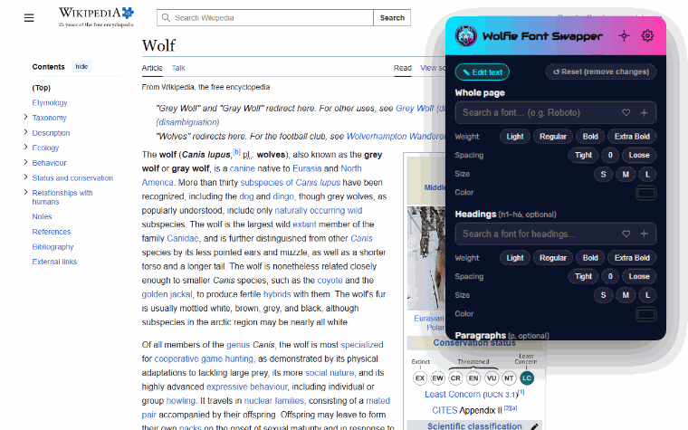

# 🐺 Wolfie Font Swapper

A simple Chrome extension for **quickly swapping and previewing fonts** on any web page. Pick a font from a searchable dropdown and the style is **injected instantly** — no reload.

> 🧑‍💻 **Built mainly as a developer tool** — a fast way to try, compare and *find* fonts directly on real pages before committing to them in code.

Author: **Wolfie Paweł Witek**



---

## ✨ Features

- **Searchable dropdown (async)** — start typing a font name (e.g. `Roboto`, `Inter`, `Georgia`). Search is **debounced (~0.8 s)** and filters on the fly (with a brief "Searching…" hint). The list renders in batches and **lazy-loads on scroll**, so 300+ fonts never slow the popover down.
- **Google Fonts + system fonts** — 300+ Google families (loaded on demand) plus your system fonts. On first focus of a search field the extension (with one‑time consent) **enumerates the fonts actually installed** on your machine via the Local Font Access API — no extra manifest permission. Each entry is tagged **Google** / **System**, and the most popular Google Fonts are pinned to the top (★).
- **Five independent sections:**
  - **Whole page** — sets `font-family` on the whole document.
  - **Headings** (`h1`–`h6`) — optional override.
  - **Paragraphs** (`p`) — optional override.
  - **Navigation** (`nav`, `[role="navigation"]`, `.navbar`, `.menu`, `header ul`…) — optional override.
  - **Buttons** (`button`, `[role="button"]`, `.btn`, `input[type=submit]`…) — optional; besides font/weight/spacing/size it has a **Letter case** chip group (`text-transform`: ABC / abc / Abc).
- **Quick chips under every section** — optional one‑tap presets (click to toggle), per target:
  - **Weight**: Light (300) / Regular (400) / Bold (700) / Extra Bold (800),
  - **Letter spacing**: Tight (−0.5px) / 0 / Loose (1.5px),
  - **Size**: S (14px) / M (18px) / L (24px),
  - **Letter case** (Buttons only): ABC / abc / Abc.
- **Font picker (Fontninja‑style)** — the crosshair icon (in each field and the header) starts an inspector: hover the page to highlight elements and see the font + its license (Open / Commercial / Unknown); click to pick. The picked name is copied to the clipboard, and if a field was focused it's pasted there. Custom web fonts found on the page are **captured (with their `@font-face` file embedded as `data:`)** and saved, so you can reuse them anywhere.
- **Live hover preview** — hovering a font in the dropdown previews it on the page instantly (debounced, async); moving away reverts to your committed choice, clicking commits it.
- **Persistent font cache** — each Google font is fetched & embedded **once** and cached in `chrome.storage.local` (LRU‑capped), so previews and reuse across tabs/sessions need no network.
- **Instant style injection** — change is visible immediately after selection.
- **Google fonts loaded for real, bypassing page CSP** — the extension fetches the `.woff2` files itself, embeds them as `data:` URLs and injects them via `insertCSS`, so the preview works even on sites that block external fonts.
- **Favorites ❤** — click the heart next to any field to favorite the current font. Favorites are **pinned to the very top** of the dropdown (above the popular Google fonts) and persisted in `chrome.storage.local`.
- **Presets (up to 5)** — save the current setup as a preset, load it with one click, delete with ✕. Presets are **persistent across sessions** and **independent of the style reset**.
- **One‑click reset** — the "↺ Reset" button removes all injected styles and loaded fonts (favorites and presets stay).
- **Copy‑ready snippet** — after picking a font, ready code appears in tabs:
  - **CSS** — with a Google Fonts `@import` and `font-family` rules,
  - **SCSS** — with variables (`$font-base`, `$font-heading`, …),
  - **JS** — dynamic `<link>` + `<style>` injection.

  A **PAID** badge and a **Buy font** button appear for commercial fonts (when a purchase link is known).
- **9 languages** — PL, EN, FR, DE, ES, UK, RU, RO, IT. Follows the browser language by default; switchable in the options page.
- **Keyboard shortcut `Ctrl+Shift+L`** (`⌘+Shift+L` on macOS) opens the popover.

---

## 🛠️ Options page

Open via the gear icon in the popover header. It includes:

- **Interface language** switcher.
- **Custom fonts** manager — fonts picked from pages: searchable list with lazy‑load, live preview (heading + paragraph), **exact license** (authoritatively read from Google's metadata: OFL / Apache 2.0 / Ubuntu Font License, with a link) and a **Free / $** cost indicator, links to **Google Fonts, Adobe Fonts, MyFonts, Fontspring, Font Squirrel, DaFont, WhatFontIs**, plus **Copy CSS** / download the CSS / download the font file. Includes a **Purge all** button.
- **Favorite fonts** manager — the same UI as custom fonts, for your favorites, with its own **Purge all**.
- **Presets** — your saved presets with an editable name and a font summary.

---

## 🧩 Installation (developer mode)

1. Open `chrome://extensions`.
2. Enable **Developer mode** (top‑right toggle).
3. Click **Load unpacked** and select the `wolfie-font-swapper` folder.
4. Done — pin the icon and press `Ctrl+Shift+L` to open the popover.

> You can change the shortcut at `chrome://extensions/shortcuts`.

---

## 🚀 Usage

1. Open any web page.
2. Press `Ctrl+Shift+L` (or click the extension icon).
3. In **Whole page**, type a font name and pick it from the list — the page changes right away.
4. (Optional) set separate fonts for **Headings**, **Paragraphs**, **Navigation**, **Buttons**.
5. Use the chips to tweak weight / spacing / size, and ❤ to save favorites.
6. Copy the ready snippet (CSS / SCSS / JS) to move the font into your own project.
7. Click **↺ Reset** to restore the original fonts.

---

## 📁 Project structure

```
wolfie-font-swapper/
├── manifest.json     # Manifest V3, permissions, shortcut, options page
├── background.js     # Service worker (shortcut registration)
├── popup.html/.css/.js   # Popover UI and logic
├── options.html/.js  # Options page (language, custom/favorite fonts, presets)
├── fonts.js          # Font list (Google + system) + popular set
├── fonts-meta.js     # Licenses, commercial DB, search providers
├── i18n.js           # Translations (9 languages) + t() helper
├── fonts/            # Bundled UI fonts (Rubik, Audiowide) + their OFL licenses
├── icons/            # Icons 16/48/128 + wolfie-logo.svg
└── README.md
```

---

## 🔒 Permissions

A minimal, store‑friendly set:

- `activeTab` + `scripting` — inject/remove styles **on the active tab only**, after you open the popover (a user gesture). No `<all_urls>`.
- `storage` — locally remember selection, presets, favorites and language.
- `host_permissions` limited to `fonts.googleapis.com`, `fonts.gstatic.com` (download previewed fonts) and `fonts.google.com` (read license metadata).

The extension **does not collect or send any personal data** — see [PRIVACY.md](PRIVACY.md).

---

## 📄 License

[MIT](LICENSE) © 2026 Wolfie Paweł Witek — applies to the **extension's own code**.

The distributed package also bundles third-party components under their own
licenses — see [`licenses/THIRD_PARTY_NOTICES.txt`](licenses/THIRD_PARTY_NOTICES.txt).
Most notably it includes **`ExtPay.js`** (the ExtensionPay client, used for the
optional Pro subscription), which is licensed **AGPL-3.0-or-later**
([full text](licenses/AGPL-3.0.txt), source: <https://github.com/glench/ExtPay>).
Because AGPL is copyleft, the **complete corresponding source for the distributed
build is published** at <https://github.com/wolfiesites/wolfie-font-swapper>.

---

## 🔤 Font licenses & credits

- **Bundled UI fonts** (shipped in this package, used for the extension's own
  interface and title):
  - **Rubik** — © The Rubik Project Authors — **SIL Open Font License 1.1**
    ([fonts/Rubik-OFL.txt](fonts/Rubik-OFL.txt)).
  - **Audiowide** — © Brian J. Bonislawsky / Astigmatic (AOETI) — **SIL Open
    Font License 1.1** ([fonts/Audiowide-OFL.txt](fonts/Audiowide-OFL.txt)).
- **Preview / applied fonts** — **Google Fonts** (SIL OFL 1.1 or Apache License
  2.0), fetched on demand from `fonts.googleapis.com` / `fonts.gstatic.com`.
  Free Google families are also used as preview substitutes for premium fonts.
- **Commercial font names** listed in the picker (e.g. Helvetica, Gotham, Univers)
  are **trademarks of their respective owners**. No commercial font files are
  bundled or served — only the name and a link to purchase the font from the
  publisher / MyFonts (affiliate links, marked `rel="sponsored"`).
- **Fonts captured with the page picker** are downloaded by **you** from the page
  you visit and stored locally on your machine — reusing them elsewhere requires
  the appropriate license from the font's owner.

> SIL OFL 1.1 permits bundling/redistribution of the above fonts provided the
> license text and copyright notice accompany them (included in `fonts/`).

---

## ⚠️ Notes

- On protected pages (`chrome://`, the Chrome Web Store) injection is blocked by Chrome — that's expected.
- Some sites use icon fonts (e.g. Material Icons). The base selector deliberately skips elements whose class contains `icon` so it doesn't break them.
- Cross‑origin font files without CORS can't be captured by the picker — in that case only the font name is saved.
